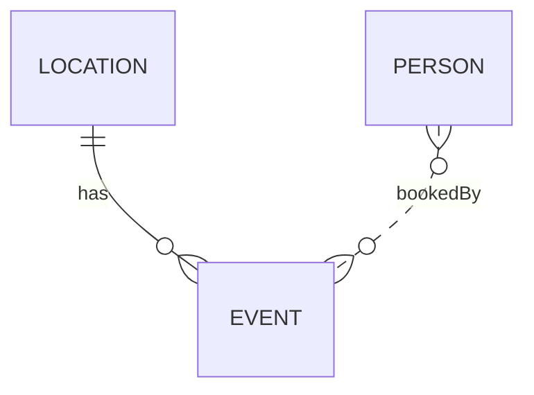
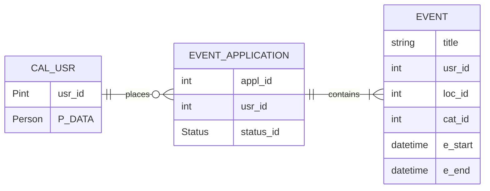
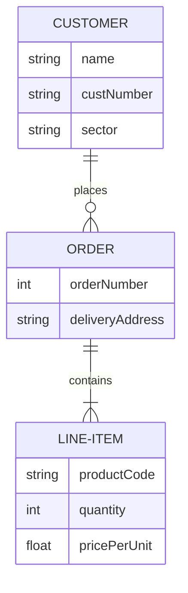

# Foo
- https://mermaid.js.org/syntax/entityRelationshipDiagram.html

```mermaid
erDiagram
    LOCATION ||--o{ EVENT : has 
    PERSON }o..o{ EVENT : bookedBy
```

```mermaid
erDiagram
    direction LR
    CAL_USR ||--o{ EVENT_APPLICATION : places
    CAL_USR {
        Pint usr_id
        Person P_DATA
        
    }
    EVENT_APPLICATION ||--|{ EVENT : contains
    EVENT_APPLICATION {
        int appl_id
        int usr_id
        Status  status_id
    }
    EVENT {
        string title
        int usr_id
        int loc_id
        int cat_id
        datetime e_start
        datetime e_end
    }


```

```mermaid
erDiagram
    
    CUSTOMER ||--o{ ORDER : places
    CUSTOMER {
        string name
        string custNumber
        string sector
    }
    ORDER ||--|{ LINE-ITEM : contains
    ORDER {
        int orderNumber
        string deliveryAddress
    }
    LINE-ITEM {
        string productCode
        int quantity
        float pricePerUnit
    }
```