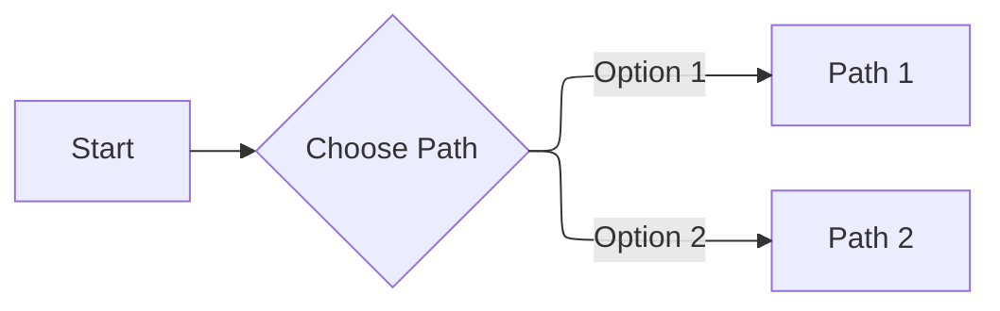
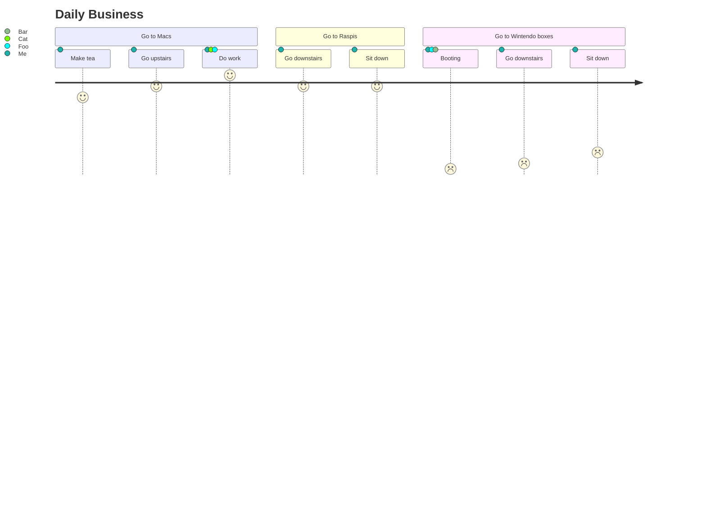
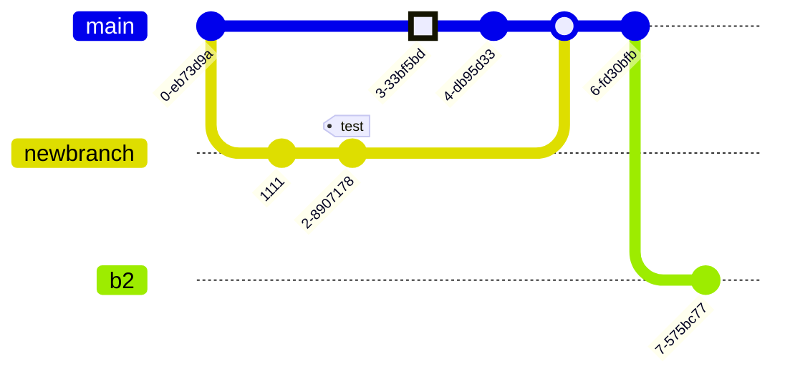
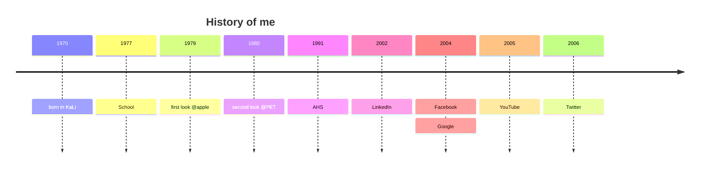
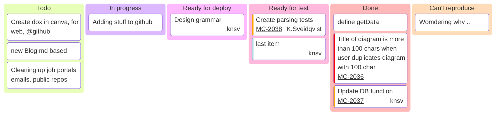
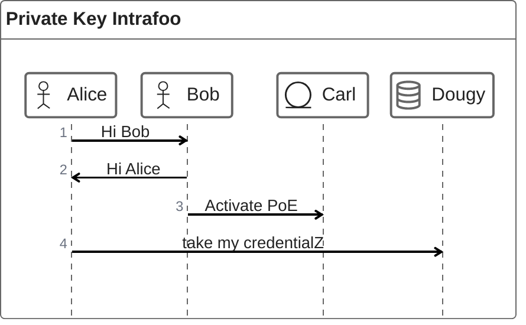

```mermaid
---
config:
  layout: elk
  look: handDrawn
  theme: dark
---

flowchart LR
direction TB
  A[Start] --> B{Login}
  B -->|OK| C[Continue]
  B -->|NotOK| B[Re-Login]
  
  C -->E[App start]
```

```mermaid
---
config:
  layout: elk
  elk:
    mergeEdges: true
    nodePlacementStrategy: LINEAR_SEGMENTS
---
flowchart LR
  A[Start] --> B{Choose Path}
  B -->|Option 1| C[Path 1]
  B -->|Option 2| D[Path 2]


```

```mermaid

journey
      accTitle: My User Journey Diagram
      accDescr: My User Journey Diagram Description

      title Daily Business
      section Go to Macs
        Make tea: 7: Me
        Go upstairs: 8: Me
        Do work: 9: Me, Cat, Foo
      section Go to Raspis
        Go downstairs: 8: Me
        Sit down: 8: Me
      section Go to Wintendo boxes
        Booting: 0.5: Me, Foo, Bar
        Go downstairs: 1: Me
        Sit down: 2: Me
```

# Git Graph example

```mermaid
gitGraph:
    commit "Ashish"
    branch newbranch
    checkout newbranch
    commit id:"1111"
    commit tag:"test"
    checkout main
    commit type: HIGHLIGHT
    commit
    merge newbranch
    commit
    branch b2
    commit
```

```mermaid
timeline
    title History of me
    1970 : born in KaLi
    1977 : School
    1979 : first look @apple
    1980 : second look @PET
    1991 : AHS
    2002 : LinkedIn
    2004 : Facebook
         : Google
    2005 : YouTube
    2006 : Twitter


```

## Kanban example

```mermaid
---
config:
  kanban:
    ticketBaseUrl: 'https://mermaidchart.atlassian.net/browse/#TICKET#'
---
kanban
  Todo
    [Create dox in canva, for web, @github]
    dox[new Blog md based]
    [Cleaning up job portals, emails, public repos]
  [In progress]
    id6[Adding stuff to github]
  id9[Ready for deploy]
    id8[Design grammar]@{ assigned: 'knsv' }
  id10[Ready for test]
    id4[Create parsing tests]@{ ticket: MC-2038, assigned: 'K.Sveidqvist', priority: 'High' }
    id66[last item]@{ priority: 'Very Low', assigned: 'knsv' }
  id11[Done]
    id5[define getData]
    id2[Title of diagram is more than 100 chars when user duplicates diagram with 100 char]@{ ticket: MC-2036, priority: 'Very High'}
    id3[Update DB function]@{ ticket: MC-2037, assigned: knsv, priority: 'High' }

  id12[Can't reproduce]
    id3[Womdering why ...]

```

'' UML stuff

```mermaid
zenuml
    title Private Key Intrafoo
    @Actor Alice
    @Actor Bob
    @Entity Carl
    @Database Dougy
    Alice->Bob: Hi Bob
    Bob->Alice: Hi Alice
    Bob->Carl: Activate PoE
    Alice->Dougy: take my credentialZ

```